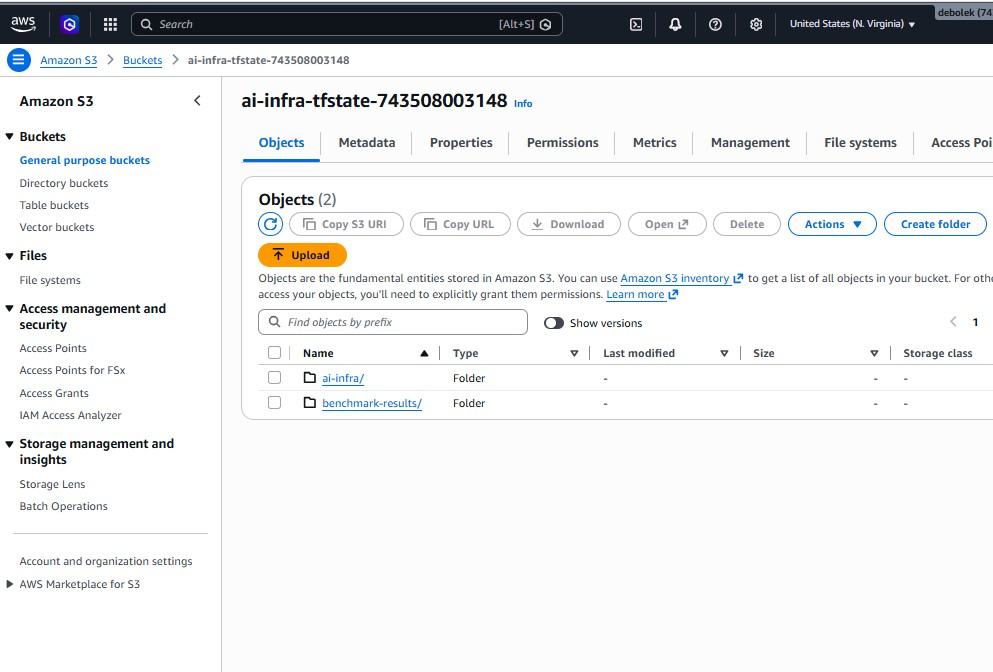
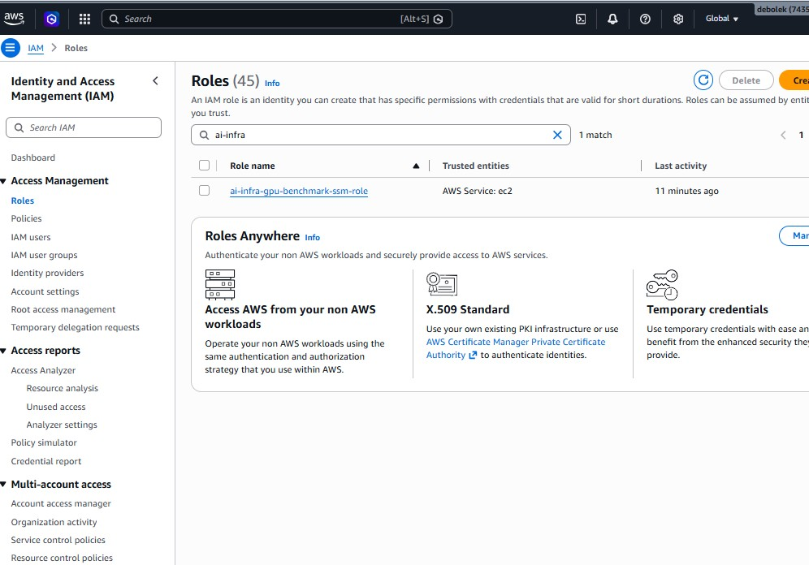
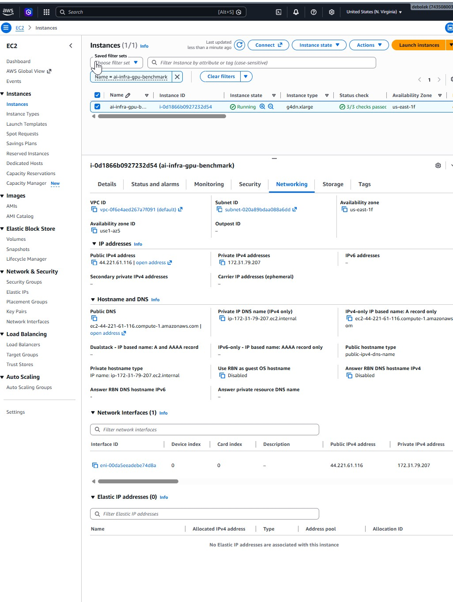
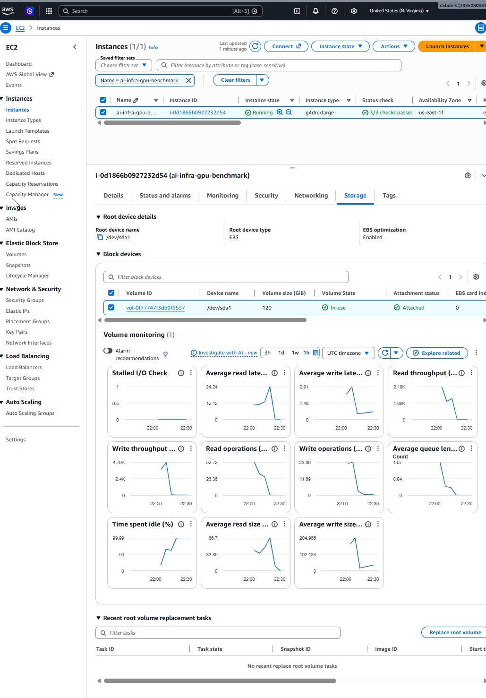
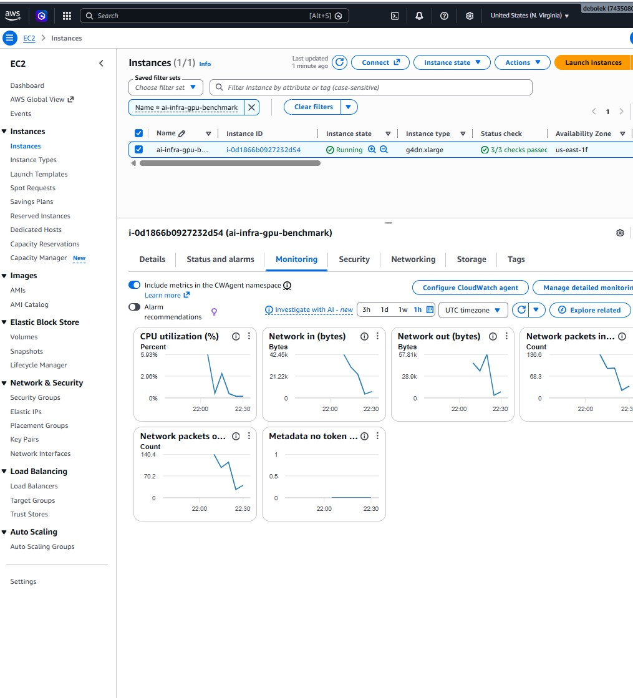
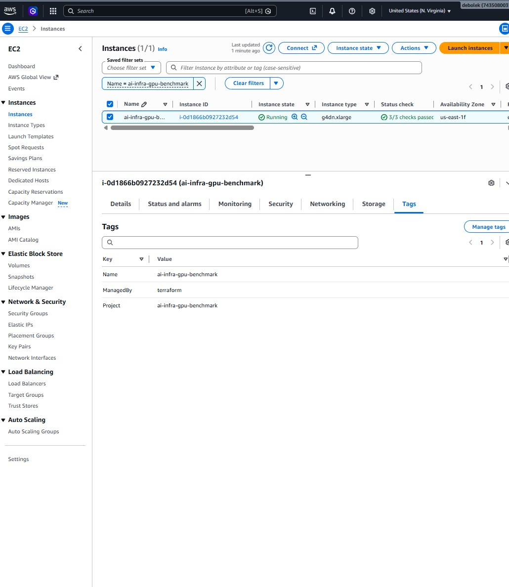

# AI Infra Lab — CPU vs GPU Performance for Machine Learning


> **Stack in one line:** Terraform provisions an AWS EC2 GPU instance (NVIDIA T4, Deep
> Learning AMI); PyTorch/CUDA run the CPU-vs-GPU benchmarks; access is via SSM (no SSH);
> Terraform state lives in S3 + DynamoDB.

A hands-on infrastructure project that provisions a GPU-backed EC2 instance on AWS with
**Terraform**, runs a set of **PyTorch** benchmarks comparing CPU vs GPU, and produces
charts you can publish. Built as a portfolio piece for AI Infrastructure / GPU / HPC work.

> Everything is defined as code. Spin the environment up with one command, run the
> benchmarks, publish the results, then tear it all down with `terraform destroy` so you
> never pay for an idle GPU.

---

## Why I built this

I'm moving into **AI infrastructure, GPU, and HPC** work, and I wanted a project that
proves the full loop an infra engineer owns end-to-end — not a notebook with borrowed
numbers, but a real GPU server I provisioned, secured, benchmarked, and tore down myself.

This project demonstrates, on live AWS infrastructure:

- **Provisioning GPU compute as code** with Terraform (reproducible, disposable).
- **Production-grade access and state:** SSM-only access (no SSH, no open ports), an IAM
  role for least-privilege, and remote Terraform state in S3 with DynamoDB locking.
- **Real measurement:** actual CPU-vs-GPU benchmarks on an NVIDIA Tesla T4, showing where
  a GPU wins (and where it doesn't).
- **Cost discipline:** the accelerator runs for minutes, is auto-shutdown-protected, and
  is destroyed the moment the work is done.

The benchmark is the hook; the infrastructure around it is the point.

## Proof it ran on real GPU hardware

All three commands below were run **live on the provisioned instance**, reached entirely
through **AWS SSM Session Manager — no SSH, no open ports**. Each is shown with what it
does and what its output proves.

### 1. `nvidia-smi` — is there a real GPU, and what is it?

`nvidia-smi` is NVIDIA's driver tool. It talks to the physical GPU and reports the model,
driver/CUDA version, temperature, power, and memory. If there were no GPU (or drivers
weren't working), this command would fail. It's the standard first check on any GPU box.

```text
Fri Sep  4 22:57:04 2026
+-----------------------------------------------------------------------------------------+
| NVIDIA-SMI 595.91.07              Driver Version: 595.91.07      CUDA Version: 13.2      |
+-----------------------------------------+------------------------+----------------------+
| GPU  Name                 Persistence-M | Bus-Id          Disp.A | Volatile Uncorr. ECC |
|=========================================+========================+======================|
|   0  Tesla T4                       On  |   00000000:00:1E.0 Off |                    0 |
| N/A   41C    P0             33W /   70W |       0MiB /  15360MiB |      0%      Default |
+-----------------------------------------+------------------------+----------------------+
```

**What it proves:** a real **NVIDIA Tesla T4** with **15,360 MiB (16 GB)** of GPU memory is
attached, drivers are healthy (v595.91.07, CUDA 13.2), idle at 33 W / 41 °C — a genuine,
working GPU, not an emulator or a CPU pretending.

### 2. PyTorch CUDA check — can the ML framework actually use the GPU?

A GPU being present isn't enough; the ML framework has to be able to talk to it. This runs
Python (from the Deep Learning AMI's PyTorch venv) and asks PyTorch directly whether CUDA
is available and which device it sees.

```bash
/opt/pytorch/bin/python -c "import torch; \
  print('torch', torch.__version__); \
  print('cuda available:', torch.cuda.is_available()); \
  print('device:', torch.cuda.get_device_name(0)); \
  print('capability:', torch.cuda.get_device_capability(0))"
```

```text
torch 2.13.0+cu130
cuda available: True
device: Tesla T4
capability: (7, 5)
```

**What it proves:** PyTorch **2.13 built against CUDA 13.0** sees the GPU
(`cuda available: True`) and identifies it as a **Tesla T4** with compute capability
**7.5**. This is the link between hardware and benchmarks — the code really runs on the
GPU, not silently falling back to CPU.

### 3. Instance identity from inside the box — is this the instance I provisioned?

This queries the EC2 **Instance Metadata Service** (a link-local address only reachable
from inside the instance) to read the machine's own ID, type, and location. It ties the
session back to the exact resource Terraform created and to the AWS console.

```bash
TOKEN=$(curl -s -X PUT "http://169.254.169.254/latest/api/token" \
  -H "X-aws-ec2-metadata-token-ttl-seconds: 60")
curl -s -H "X-aws-ec2-metadata-token: $TOKEN" \
  http://169.254.169.254/latest/meta-data/instance-id
curl -s -H "X-aws-ec2-metadata-token: $TOKEN" \
  http://169.254.169.254/latest/meta-data/instance-type
curl -s -H "X-aws-ec2-metadata-token: $TOKEN" \
  http://169.254.169.254/latest/meta-data/placement/availability-zone
```

```text
instance-id:   i-0d1866b0927232d54
instance-type: g4dn.xlarge
region/az:     us-east-1f
```

**What it proves:** the session is on instance **`i-0d1866b0927232d54`**, type
**`g4dn.xlarge`**, in **`us-east-1`** (Northern Virginia) — the exact instance ID Terraform
reported on `apply`, in the region where the GPU quota was approved. Same box, end to end.

> The `PUT`-then-`GET` token flow is **IMDSv2**, the secure, current way to read instance
> metadata.

### Screenshots from the AWS console

Visual evidence of the live infrastructure (all in `us-east-1`, N. Virginia).

**The GPU instance running** — `g4dn.xlarge`, 3/3 status checks, instance `i-0d1866b0927232d54`:


**Live terminal (via SSM)** — `nvidia-smi` showing the Tesla T4, the PyTorch CUDA check, and the instance identity, all in one session with no SSH:


**Benchmark results running on the instance:**


**Security group with zero inbound rules** — access is SSM-only, no attack surface:


**SSM connection** — reaching the box through Session Manager:


**IAM role attached to the instance** — least-privilege SSM access:


**Deep Learning GPU AMI** used for the instance:


**Remote Terraform state in S3** and the **DynamoDB lock table**:





**GPU vCPU service quota** (the approved limit that made this possible):


<details>
<summary>More console views (instance details, networking, storage, monitoring, tags)</summary>










</details>

---

## What exactly are we doing here?

**In one sentence:** we use Terraform to stand up a real GPU server on AWS, run the same
machine-learning math on a CPU and on the GPU, measure how much faster the GPU is, and
then destroy the server so it costs almost nothing.

That's the whole loop. But the *reason* it's built this way is the point of the project,
so here's the longer version.

Modern AI runs on **accelerators** — GPUs today, and increasingly specialized chips. A
model like an LLM or an image classifier is, under the hood, a mountain of the same small
math operation (multiply-add) repeated billions of times. A CPU does those more or less
one after another with a handful of powerful cores. A GPU has thousands of smaller cores
that do them all *at the same time*. When the work is big and parallel, that's the
difference between a training job finishing in an hour versus a week.

This project makes that difference **visible and measurable** with two workloads:

- **Matrix multiplication** at growing sizes — the raw building block of every neural
  network layer. It shows the exact point where the GPU stops being overkill and starts
  crushing the CPU.
- **CNN training** — a small image model trained for a few steps, measured in
  images/second. This is closer to a real training job.

### Why this matters for AI Infrastructure and HPC

I'm using this as a stepping stone into **AI infrastructure, GPU, and HPC** work, so the
project is deliberately about the *infrastructure engineer's* job, not the data
scientist's. The model is trivial on purpose — the interesting, career-relevant skills are
everything around it:

- **Provisioning accelerators as code.** Real GPU fleets aren't clicked together in a
  console; they're described in Terraform so they're reproducible, reviewable, and
  disposable. That's the core HPC/infra discipline.
- **Access without attack surface.** Instead of opening SSH to the internet, access goes
  through **AWS SSM Session Manager** — no inbound ports, no SSH keys to leak, every
  session authenticated by IAM and logged. This is how mature teams reach their machines.
- **Remote, locked state.** Terraform state lives in **S3 with DynamoDB locking**, the
  same pattern a team would use so two engineers can't corrupt each other's changes.
- **Cost control as a first-class concern.** GPUs are expensive by the hour. The project
  bakes in `terraform destroy` and an **auto-shutdown safety net** so an idle accelerator
  can't quietly rack up a bill — exactly the discipline that matters when you own a fleet.
- **Measuring, not guessing.** Knowing *when* a GPU actually helps (big parallel work) and
  when it's wasted money (tiny models, tiny batches) is the judgment call infra engineers
  are paid to make. This project builds the intuition with real numbers.

Put simply: the benchmark is the hook, but the **infrastructure around it is the résumé.**

### The full loop this demonstrates

1. **Provision** a GPU instance reproducibly (Terraform + AWS Deep Learning AMI)
2. **Secure** it (access via SSM Session Manager — zero inbound ports, no SSH keys, IAM-controlled and logged)
3. **Benchmark** CPU vs GPU on representative workloads (matrix multiply + CNN training)
4. **Measure & visualize** where the GPU wins and by how much
5. **Tear down** cleanly to control cost (plus an auto-shutdown safety net)

---

## Tech stack — what each piece does

| Tool / service | Role in this project |
|---|---|
| **Terraform** | Infrastructure as code. Declares the whole environment (GPU instance, IAM, security group, state backend) so it's reproducible and can be created or destroyed with one command. |
| **AWS EC2** | The compute. A `g4dn.xlarge` instance provides the physical GPU we benchmark against a CPU. |
| **NVIDIA T4 GPU** | The accelerator under test — the hardware that runs the parallel math the benchmarks measure. |
| **AWS Deep Learning AMI** | The instance's operating system image, with NVIDIA drivers, CUDA, and PyTorch preinstalled — so no manual GPU driver setup. |
| **AWS SSM Session Manager** | How we get a shell into the instance. Works over the instance's outbound connection, so **no inbound ports / no SSH keys**. IAM-gated and logged. |
| **AWS IAM** | The permissions layer. An IAM role + instance profile grants the instance exactly the access it needs to register with SSM — nothing more. |
| **Amazon S3** | Stores the Terraform state file remotely — versioned and encrypted — so state is durable and shareable rather than trapped on one laptop. |
| **Amazon DynamoDB** | State **locking**. Prevents two `terraform apply` runs from writing state at the same time and corrupting it. |
| **Security Group** | The instance firewall. Configured with **zero inbound rules** (SSM needs none) and open egress for package downloads. |
| **PyTorch** | The ML framework the benchmarks are written in. Runs the same operations on CPU and GPU so the comparison is apples-to-apples. |
| **CUDA** | NVIDIA's GPU compute layer that PyTorch calls under the hood to actually run work on the T4. |
| **Python** | The language for the benchmark scripts and the results/plotting glue. |
| **Matplotlib** | Renders the benchmark results into the charts you publish. |
| **Jupyter Notebook** | An interactive version of the benchmarks (`notebooks/cpu_vs_gpu.ipynb`), mirroring the original lab, reached via SSM port-forwarding. |
| **AWS CLI** | Drives AWS from the terminal — checking the GPU quota, opening SSM sessions, and authenticating Terraform. |
| **Bash / PowerShell** | Helper scripts: `setup.sh` prepares the instance; the rest of the workflow runs from PowerShell on Windows. |

---

## Architecture

```
Local machine                                   AWS (us-east-1)
+-------------------+                       +----------------------------------+
|  Terraform CLI    |  ---- provision --->  |  EC2 g4dn.xlarge (NVIDIA T4)     |
|  AWS CLI + SSM    |  <== SSM session ==>  |  AWS Deep Learning AMI          |
|  plugin           |   (no inbound ports)  |  PyTorch + CUDA pre-installed   |
|  Jupyter (browser)|  <= SSM port-fwd ===  |  IAM role: SSM core             |
+-------------------+                       |  Security group: NO inbound     |
        |                                   +----------------------------------+
        v
   Terraform state ->  S3 bucket (versioned, encrypted) + DynamoDB lock table
```

Access runs *over the instance's outbound connection to the SSM service*, so the security
group opens **zero inbound ports** — no SSH, no public notebook. Jupyter is reached by
forwarding a port through the same SSM channel.

---

## Repository layout

```
AI-Infra/
├── README.md                  # This file
├── .gitignore
├── terraform/                 # Infrastructure as code
│   ├── main.tf                # EC2 instance + AMI lookup + S3 backend + auto-shutdown
│   ├── iam.tf                 # IAM role + instance profile for SSM access
│   ├── variables.tf           # region, instance type, AMI choice, auto-shutdown
│   ├── outputs.tf             # SSM session + port-forward commands
│   ├── security_group.tf      # NO inbound; egress-only (SSM)
│   ├── backend.hcl.example    # S3 backend config (bucket, region, lock table)
│   ├── terraform.tfvars.example
│   └── bootstrap/             # creates the S3 bucket + DynamoDB lock table
│       ├── main.tf
│       ├── variables.tf
│       ├── outputs.tf
│       └── terraform.tfvars.example
├── benchmarks/
│   ├── requirements.txt
│   ├── bench_utils.py         # device detection + accurate CUDA timing helpers
│   ├── matmul_benchmark.py    # CPU vs GPU matrix multiply
│   ├── cnn_benchmark.py       # CPU vs GPU CNN training
│   └── plot_results.py        # renders charts from results/
├── notebooks/
│   └── cpu_vs_gpu.ipynb       # Notebook version (mirrors the lab)
├── scripts/
│   ├── setup.sh               # install deps / verify GPU on the instance
│   └── tunnel.sh              # (legacy SSH tunnel; SSM port-forward is preferred)
├── results/                   # benchmark output (json + png)
└── docs/
    └── writeup.md             # blog-post-style narrative for your site
```

---

## Prerequisites

- An AWS account with permission to create EC2, IAM roles, security groups, S3, DynamoDB
- [Terraform](https://developer.hashicorp.com/terraform/downloads) >= 1.5
- [AWS CLI](https://docs.aws.amazon.com/cli/latest/userguide/getting-started-install.html) configured (`aws configure` or SSO)
- The [Session Manager plugin](https://docs.aws.amazon.com/systems-manager/latest/userguide/session-manager-working-with-install-plugin.html)
  for the AWS CLI (on Windows: `winget install Amazon.SessionManagerPlugin`). This is what
  lets you open a shell into the instance — no SSH key needed.
- **GPU vCPU quota**: new accounts typically have a **0 quota** for G/VT instances (it's
  0 in every region until you ask). Request an increase for "Running On-Demand G and VT
  instances" — `terraform apply` fails with `VcpuLimitExceeded` until it's granted:

  ```powershell
  # Easiest: use the helper script to file the request and track its status
  ./scripts/check_quota.ps1 -Request     # file a request for 4 vCPUs
  ./scripts/check_quota.ps1              # check current quota + request status
  ```

  Or with the raw AWS CLI:

  ```powershell
  aws service-quotas request-service-quota-increase --service-code ec2 --quota-code L-DB2E81BA --desired-value 4 --region us-east-1
  ```

---

## Quick start

### 1. Configure your variables

```powershell
cd terraform
Copy-Item terraform.tfvars.example terraform.tfvars
```

Edit `terraform.tfvars`. For the real GPU run:

- `instance_type = "g4dn.xlarge"`
- `use_deep_learning_ami = true`
- `root_volume_size = 120`
- `auto_shutdown_hours = 4`   # safety net; set 0 to disable

No SSH key or IP allow-listing needed — access is via SSM.

### 2. Bootstrap the remote state backend (one time)

State lives in **S3** with **DynamoDB** locking so it's durable, versioned, and safe for
concurrent runs. The bucket and lock table are created first by a small bootstrap config
(you can't store state in a backend that doesn't exist yet):

```powershell
cd bootstrap
Copy-Item terraform.tfvars.example terraform.tfvars
# edit terraform.tfvars -> set a globally-unique state_bucket_name
terraform init
terraform apply
cd ..
```

Then point the main config at that backend:

```powershell
Copy-Item backend.hcl.example backend.hcl
# edit backend.hcl -> paste the bucket + table names from the bootstrap output
```

### 3. Provision

```powershell
terraform init -backend-config=backend.hcl
terraform plan
terraform apply
```

Terraform prints ready-to-paste **SSM** commands (session + Jupyter port-forward) and the
auto-shutdown status. It can take a minute or two after apply for the instance to register
with SSM before a session will connect.

### 4. Connect and run the benchmarks

Open a shell on the instance via SSM (no SSH, no key):

```powershell
aws ssm start-session --target <instance-id> --region us-east-1
```

On the instance, get the code there (`git clone` your repo), then:

```bash
cd AI-Infra/benchmarks
bash ../scripts/setup.sh        # verifies the GPU, installs matplotlib/jupyter
python matmul_benchmark.py
python cnn_benchmark.py
python plot_results.py          # writes charts into ../results/
```

To use the notebook instead, start Jupyter on the instance and forward its port through
SSM (no public port opened):

```powershell
aws ssm start-session --target <instance-id> --region us-east-1 `
  --document-name AWS-StartPortForwardingSession `
  --parameters '{\"portNumber\":[\"8888\"],\"localPortNumber\":[\"8888\"]}'
```

Then open the `http://localhost:8888/?token=...` URL Jupyter prints.

### 5. Tear it all down

```powershell
terraform destroy
```

This deletes the instance, IAM role, and security group so billing stops. The S3 state
bucket stays put for next time. **Do this when you're done** — and the auto-shutdown net
will power the box off after `auto_shutdown_hours` even if you forget.

---

## Cost note

`g4dn.xlarge` (NVIDIA T4) runs about **$0.53/hour** on-demand in `us-east-1`. The
benchmarks finish in minutes, so a full session is realistically **under ~$1**. Storage
(gp3 root) and the S3/DynamoDB state backend are pennies; SSM access is free.

Two layers of protection against surprise bills:

1. `terraform destroy` removes everything when you're done.
2. `auto_shutdown_hours` tells the instance to power itself off after N hours, so even a
   forgotten box stops the compute charge on its own (this run used 1 hour).

An idle GPU left running is ~$12.60/day — the whole point of doing this as code is that
"off" is as easy as "on." You can switch instance types via `instance_type` (e.g.
`p3.2xlarge` for a V100 at higher cost).

---

## Results (real numbers from a live run)

These are actual measurements from a live `g4dn.xlarge` (**NVIDIA Tesla T4**) in
`us-east-1`, running **PyTorch 2.13 + CUDA**, provisioned and benchmarked exactly as
described above.

### Matrix multiply — CPU vs GPU (Tesla T4)

| Matrix size | CPU | GPU (T4) | GPU speedup |
|---|---|---|---|
| 256 × 256   | 198 GFLOP/s  | 933 GFLOP/s   | ~5× |
| 512 × 512   | 240 GFLOP/s  | 4,566 GFLOP/s | ~19× |
| 1024 × 1024 | 267 GFLOP/s  | 5,963 GFLOP/s | ~22× |
| 2048 × 2048 | 272 GFLOP/s  | 6,020 GFLOP/s | ~22× |
| 4096 × 4096 | 260 GFLOP/s  | 4,137 GFLOP/s | ~16× |


### CNN training — CPU vs GPU (Tesla T4)

| Device | Throughput | Per step |
|---|---|---|
| CPU | 440 images/sec | 145.3 ms |
| GPU (T4) | **10,959 images/sec** | 5.8 ms |

**~25× faster on the GPU.**


### What the numbers show

- **Small matrices (256):** the GPU lead is modest (~5×). There isn't enough parallel work
  to fill the T4's cores, so launch/transfer overhead dominates — exactly the case where a
  GPU can be wasted money.
- **Large matrices (1024–2048):** the T4 pulls far ahead (~22×), sustaining ~6 TFLOP/s
  while the CPU sits flat around 0.27 TFLOP/s. This is the "big parallel work" sweet spot.
- **CNN training (~25×):** the biggest gap, because convolutions are dense and highly
  parallel — the workload GPUs are built for.

The takeaway for infra: a GPU pays off when the workload is big and parallel enough to keep
it busy. Match the accelerator to the work, or you pay accelerator prices for CPU-class
throughput.

The full narrative is in [`docs/writeup.md`](docs/writeup.md).

---

## How this run was actually executed

The full end-to-end, for reproducibility. Everything ran from PowerShell on Windows;
the instance was reached entirely through **SSM** (no SSH).

```powershell
# --- pre-flight ---
aws sts get-caller-identity                         # confirm account / SSO
.\scripts\check_quota.ps1                            # confirm G/VT vCPU quota = 4 (approved)
winget install Amazon.SessionManagerPlugin           # SSM plugin (one time)

# --- 1. bootstrap remote state (S3 + DynamoDB) ---
cd terraform\bootstrap
terraform init
terraform apply -auto-approve                        # creates bucket + lock table
cd ..

# --- 2. init main config against the S3 backend ---
terraform init "-backend-config=backend.hcl"

# --- 3. plan, then 4. apply the GPU instance ---
terraform plan
terraform apply -auto-approve                        # billing starts (~$0.526/hr)

# --- connect + benchmark, all via SSM send-command (no SSH) ---
# wait for the instance to register with SSM:
aws ssm describe-instance-information --region us-east-1 `
  --filters "Key=InstanceIds,Values=<instance-id>"

# clone the repo onto the box, check the GPU, run the benchmarks.
# The Deep Learning AMI's PyTorch lives in a venv at /opt/pytorch/bin/python.
aws ssm send-command --region us-east-1 --instance-ids <instance-id> `
  --document-name AWS-RunShellScript --parameters file://scripts/ssm_run.json
aws ssm get-command-invocation --region us-east-1 `
  --command-id <cmd-id> --instance-id <instance-id>   # read the output

# --- transfer results off the box ---
# SSM command output is too small for binary PNGs, so the instance uploads results to S3
# (a scoped s3:PutObject policy on the instance role), then we pull them down locally.
aws ssm send-command --region us-east-1 --instance-ids <instance-id> `
  --document-name AWS-RunShellScript --parameters file://scripts/ssm_upload.json
aws s3 cp s3://<state-bucket>/benchmark-results/ results/ --recursive --region us-east-1

# --- 5. tear it all down ---
terraform destroy -auto-approve                      # stops billing, removes resources
```

A couple of real-world gotchas this run surfaced (and fixed):

- **AMI name drift:** AWS renamed the Deep Learning AMI to `Deep Learning OSS Nvidia
  Driver AMI GPU PyTorch ... (Ubuntu ...)`. The AMI lookup filter was updated to match.
- **PyTorch interpreter:** on the DL AMI, PyTorch isn't the system `python3` — it's a venv
  at `/opt/pytorch/bin/python`. SSM commands must call that explicitly.
- **Binary file transfer:** SSM `send-command` output is size-limited, so charts are
  ferried out via S3 rather than inline.

The `scripts/ssm_*.json` files are the exact command payloads used, kept in the repo.

---

## License

Released into the **public domain** under [The Unlicense](https://unlicense.org). No
restrictions, no attribution required — copy it, fork it, use it however you like. See
[`LICENSE`](LICENSE).
