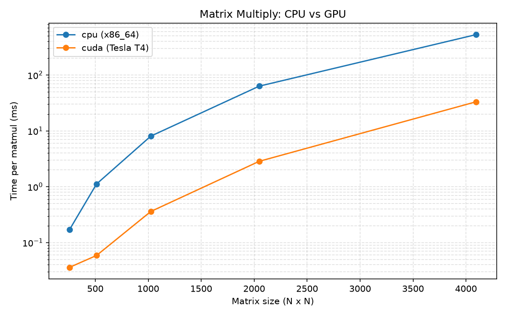
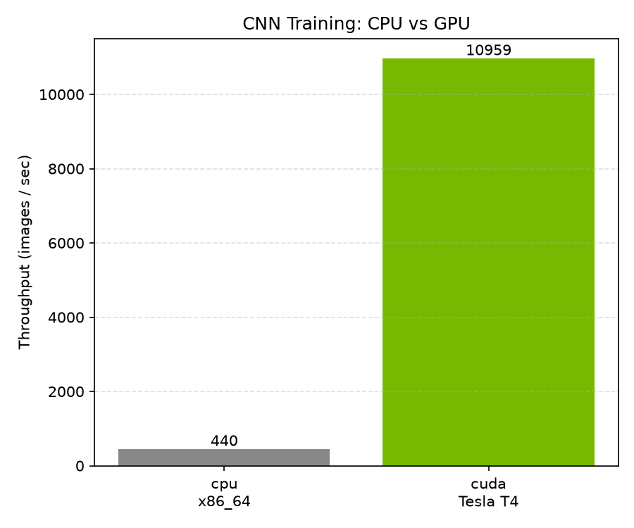
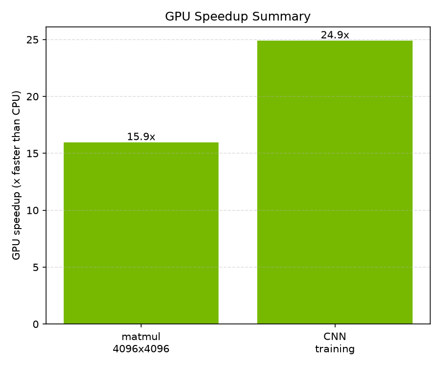

# CPU vs GPU for Machine Learning: Provisioning and Benchmarking on AWS

*A hands-on infrastructure project — provision a GPU instance with Terraform, benchmark it
against a CPU, and tear it all down when you're done.*

---

## Why I built this

I'm moving toward AI infrastructure work — GPU and HPC systems — and I wanted a project
that showed the whole loop an infra engineer actually owns, not just a notebook with some
numbers in it. The interesting part of "make ML fast" isn't only the model. It's the
plumbing: provisioning accelerators reproducibly, keeping them secure, measuring where
they help, and controlling cost so a forgotten instance doesn't quietly bill you for a
weekend.

So I took a classic exercise — comparing CPU vs GPU training time — and rebuilt it as an
infrastructure-as-code project: Terraform provisions a GPU instance on AWS, PyTorch
benchmarks run on it, charts get generated, and one command tears the whole thing back
down.

## The architecture

```
Local machine                              AWS
+-------------------+                      +--------------------------------+
|  Terraform CLI    |  ---- provision -->  |  EC2 g4dn.xlarge (NVIDIA T4)   |
|  SSH client       |                      |  AWS Deep Learning AMI         |
|  Browser (Jupyter)|  <-- SSH tunnel ---  |  PyTorch + CUDA pre-installed  |
+-------------------+                      +--------------------------------+
       state -> S3 bucket + DynamoDB lock table
```

A few deliberate choices:

- **`g4dn.xlarge` (NVIDIA T4)** instead of the older K80 from the original lab. The T4 is
  cheaper (~$0.53/hr), newer, and closer to what real inference/training fleets run today.
  It's a variable, so switching to a V100 (`p3.2xlarge`) is a one-line change.
- **AWS Deep Learning AMI** so CUDA, NVIDIA drivers, and PyTorch come pre-installed. No
  driver yak-shaving — the infra should get out of the way of the experiment.
- **Remote state in S3 with DynamoDB locking.** Local state is fine for a solo hobby run,
  but S3 + a lock table is what teams actually use: durable, versioned, and safe against
  two applies clobbering each other. There's a chicken-and-egg wrinkle — the backend can't
  create the bucket it stores state in — so a small bootstrap config creates the bucket
  and lock table first with local state.
- **SSH locked to my IP, Jupyter never exposed publicly.** The notebook port is reached
  through an SSH tunnel, so it stays off the public internet entirely.

## What the benchmarks measure

Two workloads, chosen because they sit at different points on the "does the GPU actually
help" spectrum:

1. **Matrix multiply** across sizes from 256×256 up to 4096×4096. Every dense layer in a
   neural net is a matmul, and it's the cleanest way to see the crossover point where a
   GPU starts to win.
2. **CNN training** — a small convolutional network trained on synthetic image-shaped
   data, measured in images/second. Convolutions are compute-heavy and massively parallel,
   so this reflects a realistic training speedup without needing to download a dataset.

A detail that matters for honest numbers: CUDA runs kernels **asynchronously**. If you
start a timer, launch a GPU op, and stop the timer, you've measured how long it took to
*queue* the work, not to *do* it. Every measurement here calls `torch.cuda.synchronize()`
before stopping the clock, and discards a few warmup iterations so one-time initialization
costs don't skew the average.

## What to expect from the results

*(Run the benchmarks on the instance and drop your charts from `results/` in here.)*

The pattern is consistent and worth internalizing:

- **Small matrices (256–512):** the GPU is often *no faster, or slower*. There isn't
  enough work to fill thousands of cores, so kernel-launch and data-transfer overhead
  dominate. This surprises people.
- **Large matrices (2048–4096):** the GPU pulls dramatically ahead — often 10× or more —
  because there's finally enough parallel work to saturate it.
- **CNN training:** a large, consistent speedup, since convolutions keep the GPU busy.







## The infra lesson

The headline isn't "GPUs are faster." It's **GPUs are faster when the workload is big and
parallel enough to keep them busy.** A tiny model or a tiny batch size can leave an
expensive accelerator mostly idle — you pay the T4 rate to do CPU-class work.

That's the mental model I want for infra decisions: match the accelerator to the workload,
size the batch to fill it, and never leave one running idle. Which is exactly why the last
step of this project is one command.

## Cost discipline

`g4dn.xlarge` is about **$0.53/hour** on-demand in `us-east-1`. A full benchmark session is
well under an hour. The whole point of doing this with Terraform is the teardown:

```bash
terraform destroy
```

The instance and security group disappear, billing stops, and the S3 state bucket stays
put for next time. An idle GPU left running overnight is the single most common way to get
a surprise cloud bill — infrastructure-as-code makes "off" as easy as "on."

## Reproduce it yourself

The full project (Terraform, benchmarks, notebook, scripts) is in the repo. Quick version:

```bash
# 1. bootstrap remote state (once)
cd terraform/bootstrap && terraform init && terraform apply && cd ..

# 2. provision the GPU box
terraform init -backend-config=backend.hcl && terraform apply

# 3. SSH in, run the benchmarks, generate charts
#    python matmul_benchmark.py && python cnn_benchmark.py && python plot_results.py

# 4. tear it down
terraform destroy
```

See the [README](../README.md) for the full step-by-step, including key pair creation and
the GPU vCPU quota gotcha on new AWS accounts.

---

*Built as part of my move into AI infrastructure / GPU / HPC. Feedback welcome.*
